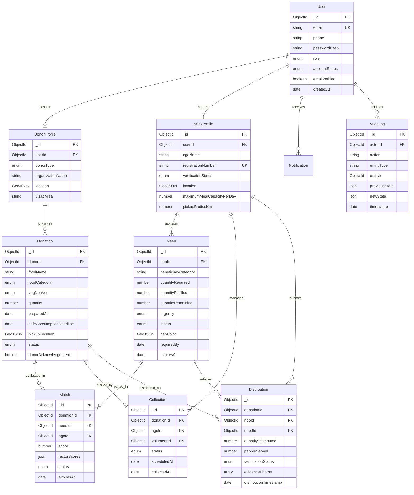
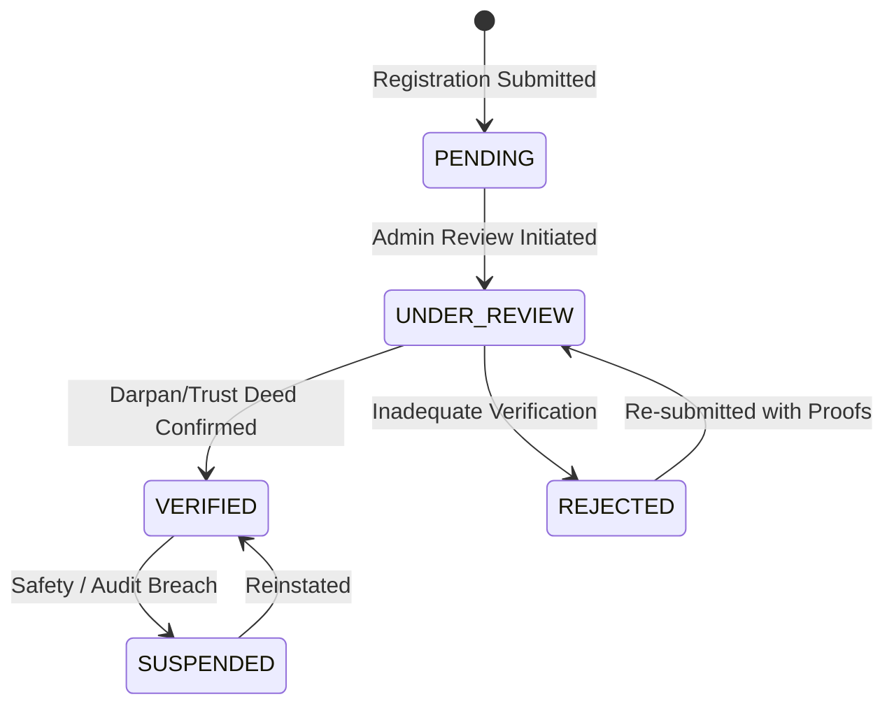
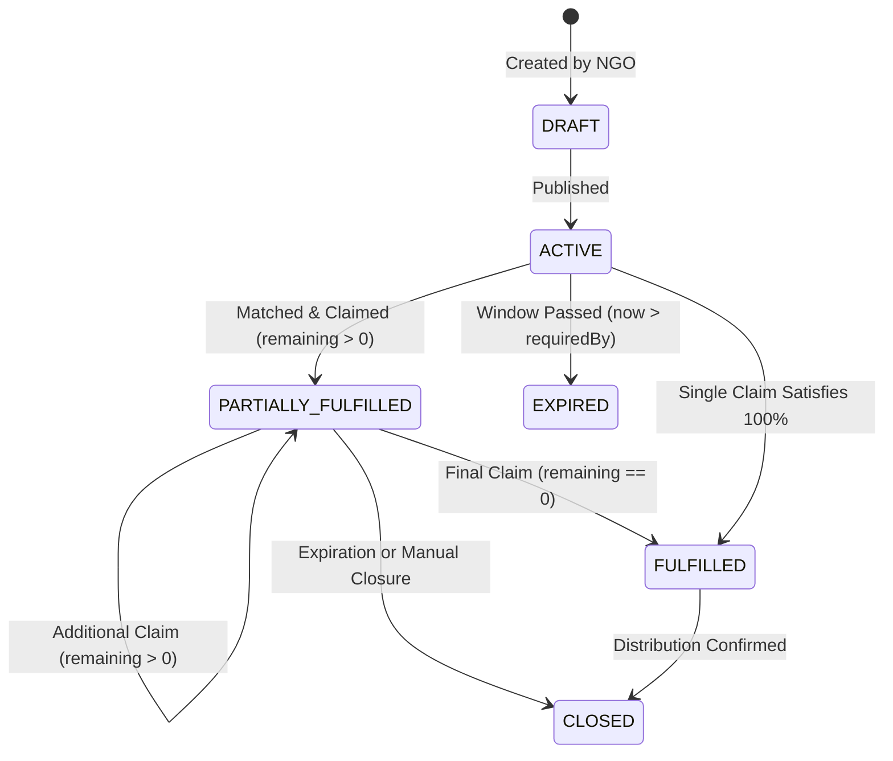
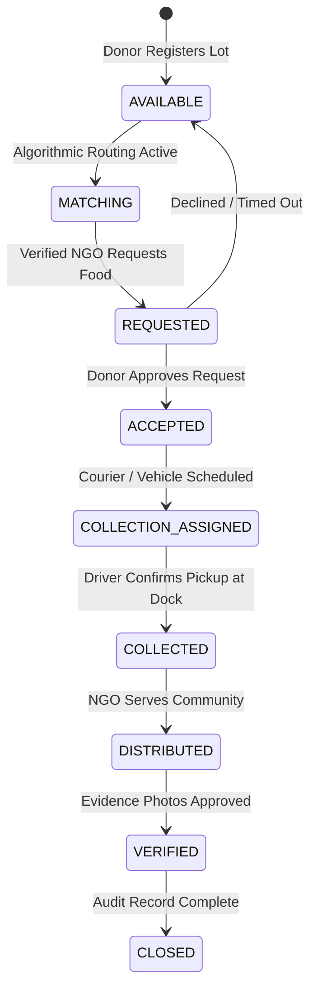

# FoodConnect — MongoDB Data Model & Backend Architecture

> **Document Version:** 1.0.0  
> **Status:** APPROVED ARCHITECTURE SPECIFICATION  
> **Target Environment:** Next.js App Router • Node.js Serverless • MongoDB Atlas • Firebase Storage • Firebase Hosting  
> **Geographic Focus:** Visakhapatnam (Vizag), Andhra Pradesh, India

---

## 1. Executive Overview & Core Product Principles

FoodConnect is an operational coordination platform designed to bridge surplus food with verified humanitarian needs across Visakhapatnam (Vizag), Andhra Pradesh.

### 1.1 Core Mission & Boundary
```
SURPLUS FOOD
  → REAL COMMUNITY NEED
    → INTELLIGENT MATCHING
      → COURIER / NGO COLLECTION
        → DIRECT COMMUNITY DISTRIBUTION
          → VERIFIED AUDIT PROOF
```

#### The Golden Operational Rules:
1. **FoodConnect does NOT physically distribute food.** Physical transit and meal handover are conducted exclusively by verified local NGOs and designated collection partners.
2. **FoodConnect does NOT certify food safety.** Donors assume sole legal and operational responsibility for declaring accurate preparation timestamps, storage histories, packaging conditions, and allergen profiles.
3. **No Unverified NGO Participation.** Only accredited, verified non-governmental organizations with documented physical facilities may accept donations, publish official community food needs, or log community distribution proofs.
4. **Quantities are Conserved.** The platform enforces mathematical consistency: `quantityRequired = quantityFulfilled + quantityRemaining`. A partially fulfilled need remains active until the remaining balance reaches zero or the expiration window lapses.
5. **Transparency Through Immutable Logs.** State mutations across donations, needs, collections, and distributions are append-only logged for platform integrity and auditability.

---

## 2. Technology Stack & Operational Context

| Layer | Selected Technology | Architectural Rationale |
| :--- | :--- | :--- |
| **Frontend** | Next.js 16 (App Router), React 19, TypeScript, Tailwind CSS v4, Base UI, Motion | High performance, accessible UX, zero UI bloat, unified design system. |
| **API Backend** | Next.js Server-Side Route Handlers (`app/api/*`) | Edge/Node runtime flexibility, co-located deployment, zero cold-start API separation. |
| **Primary Database** | MongoDB Atlas (Replica Set / Multi-Region Serverless) | Native GeoJSON `2dsphere` spatial indexing, dynamic document polymorphism for varied food types, high write throughput, atomic document updates (`$inc`, `$set`, `$push`). |
| **Validation Layer** | Zod v3 | TypeScript-first runtime schema validation, bidirectional inference, isomorphic execution across server and client. |
| **Binary/Media Storage** | Firebase Storage | Signed URL uploads, regional multi-bucket replication, immutable media references for audit photos. |
| **Authentication** | Custom FoodConnect Auth (Argon2id + HTTP-Only Session Tokens) | Complete data sovereignity, no third-party vendor lock-in, zero per-seat auth costs, strict RBAC controls. |
| **Geospatial & Maps** | Google Maps Platform API & GeoJSON 2dsphere | Routing matrices, ETA computations, reverse geocoding, and radius calculations centered on Visakhapatnam (`17.7215° N, 83.3155° E`). |

---

## 3. Exhaustive Access Pattern Catalog

Every collection, document schema, and index in this architecture is justified directly by the following access patterns:

| ID | Access Pattern Description | Entity / Target | Lookup Key(s) / Filters | Read/Write | Frequency | Latency SLA | Consistency |
| :--- | :--- | :--- | :--- | :--- | :--- | :--- | :--- |
| **AP-01** | User authentication by email | `users` | `email` (exact, lowercased) | Read | High | < 50ms | Strong |
| **AP-02** | Fetch user profile with role | `users` | `_id` | Read | High | < 20ms | Strong |
| **AP-03** | Fetch active community needs near donor | `needs` | `geoPoint` ($nearSphere), `status: ACTIVE` | Read | High | < 100ms | Eventual (5s) |
| **AP-04** | Fetch active needs by urgency & area | `needs` | `urgency`, `location.area`, `status` | Read | High | < 80ms | Read Committed |
| **AP-05** | Atomically claim/fulfill portion of a need | `needs` | `_id`, `status`, `version`, `quantityRemaining >= X` | Write | Med-High | < 120ms | Strong (Atomic) |
| **AP-06** | Query surplus donations near an NGO need | `donations` | `pickupLocation` ($nearSphere), `status: AVAILABLE` | Read | High | < 100ms | Eventual (5s) |
| **AP-07** | Fetch available donations by food category | `donations` | `status: AVAILABLE`, `foodCategory`, `vegNonVeg` | Read | High | < 80ms | Read Committed |
| **AP-08** | Atomic status transition of donation | `donations` | `_id`, `status: EXPECTED_PREV_STATUS` | Write | Medium | < 100ms | Strong (Atomic) |
| **AP-09** | Find verified NGOs within a pickup radius | `ngo_profiles` | `location` ($geoWithin / $nearSphere), `verificationStatus: VERIFIED` | Read | Medium | < 100ms | Read Committed |
| **AP-10** | Fetch pending NGO verification queue | `ngo_profiles` | `verificationStatus: PENDING` or `UNDER_REVIEW`, `createdAt` | Read | Low-Med | < 150ms | Read Committed |
| **AP-11** | Retrieve candidate matches for a donation | `matches` | `donationId`, `status: PROPOSED` | Read | Med-High | < 50ms | Read Committed |
| **AP-12** | Retrieve active matches for an NGO | `matches` | `ngoId`, `status: PROPOSED`, `expiresAt > NOW()` | Read | High | < 60ms | Read Committed |
| **AP-13** | Fetch active dispatch collection tasks | `collections` | `ngoId` or `volunteerId`, `status: [ASSIGNED, EN_ROUTE]` | Read | High | < 60ms | Read Committed |
| **AP-14** | Submit distribution proof of delivery | `distributions` | `donationId`, `ngoId`, `needId` | Write | Medium | < 150ms | Strong |
| **AP-15** | Query verified distributions for public impact | `distributions` | `verificationStatus: VERIFIED`, `distributionTimestamp` | Read | High | < 100ms | Eventual (1m) |
| **AP-16** | Unread notifications for a user | `notifications` | `userId`, `isRead: false`, `createdAt` (desc) | Read | High | < 40ms | Read Committed |
| **AP-17** | Append immutable audit log | `audit_logs` | Insertion | Write | High | < 50ms | Unacknowledged / Ack 1 |
| **AP-18** | Query entity history for dispute/audit | `audit_logs` | `entityType`, `entityId`, `timestamp` | Read | Low | < 200ms | Read Committed |
| **AP-19** | Auto-expire outdated donations / needs | `donations`, `needs` | TTL index on `safeConsumptionDeadline`, `expiresAt` | Background | Scheduled | Background | Background |
| **AP-20** | Donor dashboard: my active listings | `donations` | `donorId`, `status`, `createdAt` (desc) | Read | Medium | < 60ms | Read Committed |
| **AP-21** | NGO dashboard: my active needs & intakes | `needs` | `ngoId`, `status`, `requiredBy` | Read | Medium | < 60ms | Read Committed |

---

## 4. Logical Data Model & Entity Relationships

The data model follows a **hybrid reference and embedded document strategy**:
- **Reference** is used across distinct organizational lifecycles (`User` ↔ `DonorProfile`, `User` ↔ `NGOProfile`, `Donation` ↔ `Need`, `Donation` ↔ `Collection` ↔ `Distribution`).
- **Embedding** is used for co-accessed, bounded value objects (`address`, `pickupAvailability`, `donorAcknowledgement`, `foodHandlingCapabilities`, `factorScores`).

### 4.1 Mermaid Entity-Relationship Diagram



---

## 5. Physical MongoDB Schema Design

### 5.1 Collection: `users`
Represents core identity and credentials. Decoupled from role-specific organizational profiles.

```javascript
{
  "_id": ObjectId("6650a1b2c3d4e5f6a7b8c9d0"),
  "name": "Venkata Raman",
  "email": "raman@daspalla.com",
  "phone": "+918912564800",
  "passwordHash": "$argon2id$v=19$m=65536,t=3,p=4$...", // Secure Argon2id digest
  "role": "DONOR", // "DONOR" | "NGO" | "VOLUNTEER" | "ADMIN"
  "accountStatus": "ACTIVE", // "ACTIVE" | "PENDING" | "SUSPENDED" | "REJECTED"
  "emailVerified": true,
  "phoneVerified": true,
  "lastLoginAt": ISODate("2026-09-24T04:15:00.000Z"),
  "createdAt": ISODate("2026-08-10T10:00:00.000Z"),
  "updatedAt": ISODate("2026-09-24T04:15:00.000Z")
}
```

### 5.2 Collection: `donor_profiles`
Operational parameters for donor kitchens and businesses across Vizag.

```javascript
{
  "_id": ObjectId("6650a2c3d4e5f6a7b8c9d0e1"),
  "userId": ObjectId("6650a1b2c3d4e5f6a7b8c9d0"),
  "donorType": "HOTEL", // "INDIVIDUAL" | "RESTAURANT" | "HOTEL" | "CATERING_SERVICE" | "EVENT_ORGANIZER" | "BUSINESS" | "OTHER"
  "organizationName": "Hotel Daspalla Visakhapatnam",
  "fssaiNumber": "10118028000123", // 14-digit FSSAI registration
  "contactPerson": "Venkata Raman",
  "contactPhone": "+918912564800",
  "contactEmail": "fnb@daspallavizag.com",
  "address": {
    "street": "Surya Bagh, Jagadamba Center",
    "area": "Jagadamba Center",
    "city": "Visakhapatnam",
    "state": "Andhra Pradesh",
    "postalCode": "530020",
    "landmarks": "Opposite Jagadamba Theatre Complex"
  },
  "location": {
    "type": "Point",
    "coordinates": [83.3012, 17.7128] // [longitude, latitude]
  },
  "pickupAvailability": {
    "daysOfWeek": [0, 1, 2, 3, 4, 5, 6],
    "startTime": "14:00",
    "endTime": "23:00",
    "instructions": "Service lane gate #3 for collection vehicles"
  },
  "preferredContactMethod": "PHONE",
  "totalDonationsCount": 42,
  "totalMealsRescued": 3850,
  "createdAt": ISODate("2026-08-10T10:15:00.000Z"),
  "updatedAt": ISODate("2026-09-24T03:30:00.000Z")
}
```

### 5.3 Collection: `ngo_profiles`
Official credentials, verification state, physical storage, and capacity constraints for recipient NGOs.

```javascript
{
  "_id": ObjectId("6650a3d4e5f6a7b8c9d0e1f2"),
  "userId": ObjectId("6650b2c3d4e5f6a7b8c9d0e2"),
  "ngoName": "Sneha Sandhya Old Age & Care Trust",
  "registrationNumber": "AP/2014/0078912", // Registrar of Societies / Darpan ID
  "registrationDocumentUrls": [
    "https://storage.googleapis.com/foodconnect-prod/ngos/docs/ap-2014-reg.pdf",
    "https://storage.googleapis.com/foodconnect-prod/ngos/docs/12a-80g-cert.pdf"
  ],
  "verificationStatus": "VERIFIED", // "PENDING" | "UNDER_REVIEW" | "VERIFIED" | "REJECTED"
  "verifiedAt": ISODate("2026-08-15T09:00:00.000Z"),
  "verifiedBy": ObjectId("665000000000000000000001"), // Admin ID
  "rejectionReason": null,
  "contactPerson": {
    "name": "Dr. P. S. Sarma",
    "designation": "Managing Trustee",
    "phone": "+918912789456",
    "email": "trust@snehasandhya.org"
  },
  "address": {
    "street": "Plot 42, Sector 4, MVP Colony",
    "area": "MVP Colony",
    "city": "Visakhapatnam",
    "state": "Andhra Pradesh",
    "postalCode": "530017"
  },
  "location": {
    "type": "Point",
    "coordinates": [83.3426, 17.7386] // [longitude, latitude]
  },
  "operatingAreas": [
    "MVP Colony",
    "Siripuram",
    "East Point Colony",
    "Waltair Uplands",
    "Rushikonda"
  ],
  "foodTypesAccepted": [
    "COOKED_MEALS",
    "RAW_GRAINS_PULSES",
    "FRESH_PRODUCE",
    "DAIRY"
  ],
  "dietaryPreferences": ["PURE_VEG", "VEG_AND_NON_VEG"],
  "maximumMealCapacityPerDay": 250,
  "pickupRadiusKm": 12.5,
  "availability": {
    "daysOfWeek": [0, 1, 2, 3, 4, 5, 6],
    "openTime": "07:00",
    "closeTime": "21:00"
  },
  "communitiesServed": [
    "Geriatric Elderly Residents",
    "Destitute Women",
    "Underprivileged Day Students"
  ],
  "storageFacilities": [
    "COMMERCIAL_REFRIGERATION",
    "THERMAL_WARMERS",
    "DRY_VENTILATED_PANTRY"
  ],
  "foodHandlingCapabilities": {
    "hasThermalContainers": true,
    "hasRefrigeration": true,
    "hasDedicatedTransport": true,
    "vehicleCount": 2,
    "staffHandlerCount": 6
  },
  "totalNeedsCount": 28,
  "totalMealsReceived": 2480,
  "createdAt": ISODate("2026-08-11T11:00:00.000Z"),
  "updatedAt": ISODate("2026-09-24T02:00:00.000Z")
}
```

### 5.4 Collection: `needs`
The core community demand entity. Governs the exact quantities, timelines, and locations where meals are urgently required.

```javascript
{
  "_id": ObjectId("6650a4e5f6a7b8c9d0e1f2a3"),
  "ngoId": ObjectId("6650a3d4e5f6a7b8c9d0e1f2"),
  "beneficiaryCategory": "Sheltered Senior Citizens",
  "location": {
    "address": "Sector 4 Dining Hall, MVP Colony",
    "area": "MVP Colony",
    "city": "Visakhapatnam"
  },
  "geoPoint": {
    "type": "Point",
    "coordinates": [83.3426, 17.7386]
  },
  "peopleNeedingFood": 80,
  "quantityRequired": 80,
  "unit": "portions", // "portions" | "kg" | "packets" | "litres"
  "quantityFulfilled": 50,
  "quantityRemaining": 30, // Invariant: quantityRequired - quantityFulfilled
  "foodType": "COOKED_MEALS",
  "dietaryRequirements": "PURE_VEG",
  "urgency": "IMMEDIATE", // "IMMEDIATE" | "HIGH" | "FLEXIBLE"
  "requiredBy": ISODate("2026-09-24T13:30:00.000Z"),
  "additionalRequirements": "Low sodium, non-spicy preparation preferred for elderly residents.",
  "verificationState": "NGO_VERIFIED",
  "status": "PARTIALLY_FULFILLED", // "DRAFT" | "ACTIVE" | "PARTIALLY_FULFILLED" | "FULFILLED" | "CLOSED" | "EXPIRED"
  "expiresAt": ISODate("2026-09-24T14:30:00.000Z"),
  "version": 4, // Optimistic concurrency control counter
  "createdAt": ISODate("2026-09-24T02:30:00.000Z"),
  "updatedAt": ISODate("2026-09-24T05:00:00.000Z")
}
```

### 5.5 Collection: `donations`
Surplus lot registration containing food safety parameters, perishable deadlines, and mandatory donor acknowledgement.

```javascript
{
  "_id": ObjectId("6650a5f6a7b8c9d0e1f2a3b4"),
  "donorId": ObjectId("6650a2c3d4e5f6a7b8c9d0e1"),
  "foodName": "Fresh Lunch Buffet Surplus (Rice, Sambar, Sabzi)",
  "foodCategory": "COOKED_MEALS",
  "vegNonVeg": "VEG", // "VEG" | "NON_VEG" | "BOTH"
  "quantity": 100,
  "unit": "portions",
  "preparedAt": ISODate("2026-09-24T06:30:00.000Z"),
  "safeConsumptionDeadline": ISODate("2026-09-24T16:00:00.000Z"),
  "storageCondition": "HOT_HEATED", // "HOT_HEATED" | "REFRIGERATED" | "FROZEN" | "ROOM_TEMPERATURE"
  "packagingCondition": "STAINLESS_STEEL_VATS", // "COMMERCIAL_SEALED" | "STAINLESS_STEEL_VATS" | "FOOD_GRADE_DISPOSABLE" | ...
  "allergens": ["Gluten", "Dairy"],
  "notes": "Food held in heated bain-marie until packout. Needs thermal collection vessels.",
  "photoReferences": [
    "https://storage.googleapis.com/foodconnect-prod/donations/photos/lot-8924-a.jpg",
    "https://storage.googleapis.com/foodconnect-prod/donations/photos/lot-8924-b.jpg"
  ],
  "pickupAddress": {
    "street": "Surya Bagh, Jagadamba Center",
    "area": "Jagadamba Center",
    "city": "Visakhapatnam",
    "postalCode": "530020",
    "instructions": "Loading bay #2 behind main banquet entrance"
  },
  "pickupLocation": {
    "type": "Point",
    "coordinates": [83.3012, 17.7128]
  },
  "pickupAvailabilityWindow": {
    "start": ISODate("2026-09-24T08:00:00.000Z"),
    "end": ISODate("2026-09-24T12:00:00.000Z")
  },
  "donorAcknowledgement": {
    "accepted": true,
    "timestamp": ISODate("2026-09-24T07:15:00.000Z"),
    "ipAddress": "103.241.138.45",
    "statement": "FoodConnect does not certify food safety. Donors are responsible for providing accurate food information."
  },
  "status": "ACCEPTED", // "AVAILABLE" | "MATCHING" | "REQUESTED" | "ACCEPTED" | "COLLECTION_ASSIGNED" | "COLLECTED" | "DISTRIBUTED" | "VERIFIED" | "CLOSED"
  "activeMatchId": ObjectId("6650a6a7b8c9d0e1f2a3b4c5"),
  "assignedCollectionId": ObjectId("6650a7b8c9d0e1f2a3b4c5d6"),
  "version": 3,
  "createdAt": ISODate("2026-09-24T07:15:00.000Z"),
  "updatedAt": ISODate("2026-09-24T08:45:00.000Z")
}
```

### 5.6 Collection: `matches`
Audit record of algorithmic recommendations linking surplus lots to active needs.

```javascript
{
  "_id": ObjectId("6650a6a7b8c9d0e1f2a3b4c5"),
  "donationId": ObjectId("6650a5f6a7b8c9d0e1f2a3b4"),
  "needId": ObjectId("6650a4e5f6a7b8c9d0e1f2a3"),
  "ngoId": ObjectId("6650a3d4e5f6a7b8c9d0e1f2"),
  "score": 92, // Composite matching percentage
  "distanceKm": 3.2,
  "factorScores": {
    "distanceScore": 96,
    "foodCompatibilityScore": 98,
    "quantityAlignmentScore": 90,
    "urgencyScore": 92,
    "deadlineScore": 92,
    "storageCapacityScore": 95
  },
  "explanation": {
    "summary": "High compatibility: 3.2 km distance via Beach Road with thermal holding equipment verified.",
    "positiveFactors": [
      "Transit time under 12 minutes",
      "Pure vegetarian cooked food matches elderly dietary mandate",
      "NGO has certified thermal warmers"
    ],
    "riskFactors": [
      "Perishable hot meal: collection must commence within 90 minutes"
    ]
  },
  "status": "ACCEPTED", // "PROPOSED" | "NOTIFIED" | "ACCEPTED" | "DECLINED" | "EXPIRED" | "SUPERSEDED"
  "proposedAt": ISODate("2026-09-24T07:18:00.000Z"),
  "respondedAt": ISODate("2026-09-24T07:45:00.000Z"),
  "expiresAt": ISODate("2026-09-24T09:18:00.000Z"),
  "createdAt": ISODate("2026-09-24T07:18:00.000Z"),
  "updatedAt": ISODate("2026-09-24T07:45:00.000Z")
}
```

### 5.7 Collection: `collections`
Logistical tracking of food pickup and custody handover from donor to courier/NGO.

```javascript
{
  "_id": ObjectId("6650a7b8c9d0e1f2a3b4c5d6"),
  "donationId": ObjectId("6650a5f6a7b8c9d0e1f2a3b4"),
  "ngoId": ObjectId("6650a3d4e5f6a7b8c9d0e1f2"),
  "needId": ObjectId("6650a4e5f6a7b8c9d0e1f2a3"),
  "collectorType": "NGO_INTERNAL", // "NGO_INTERNAL" | "VOLUNTEER_PARTNER"
  "volunteerId": null, // User ObjectId if delegated to a volunteer
  "pickupAddress": {
    "street": "Surya Bagh, Jagadamba Center",
    "area": "Jagadamba Center",
    "city": "Visakhapatnam"
  },
  "pickupCoordinates": {
    "type": "Point",
    "coordinates": [83.3012, 17.7128]
  },
  "scheduledAt": ISODate("2026-09-24T09:00:00.000Z"),
  "assignedAt": ISODate("2026-09-24T07:50:00.000Z"),
  "enRouteAt": ISODate("2026-09-24T08:30:00.000Z"),
  "arrivedAt": ISODate("2026-09-24T08:52:00.000Z"),
  "collectedAt": ISODate("2026-09-24T09:15:00.000Z"),
  "status": "COLLECTED", // "ASSIGNED" | "EN_ROUTE" | "ARRIVED" | "COLLECTED" | "CANCELLED"
  "collectionPhotos": [
    "https://storage.googleapis.com/foodconnect-prod/collections/proofs/c-8924-dock.jpg"
  ],
  "temperatureAtPickupCelsius": 64.5, // Temperature verified at dock
  "notes": "Food received in clean, covered thermal containers.",
  "createdAt": ISODate("2026-09-24T07:50:00.000Z"),
  "updatedAt": ISODate("2026-09-24T09:15:00.000Z")
}
```

### 5.8 Collection: `distributions`
The verified proof of community handover. Only documents with `verificationStatus: VERIFIED` roll up into public impact dashboards.

```javascript
{
  "_id": ObjectId("6650a8c9d0e1f2a3b4c5d6e7"),
  "donationId": ObjectId("6650a5f6a7b8c9d0e1f2a3b4"),
  "ngoId": ObjectId("6650a3d4e5f6a7b8c9d0e1f2"),
  "needId": ObjectId("6650a4e5f6a7b8c9d0e1f2a3"),
  "collectionId": ObjectId("6650a7b8c9d0e1f2a3b4c5d6"),
  "quantityDistributed": 50,
  "unit": "portions",
  "peopleServed": 50,
  "distributionTimestamp": ISODate("2026-09-24T10:30:00.000Z"),
  "distributionLocation": {
    "communityCenterName": "Sneha Sandhya Community Dining Pavilion",
    "street": "Sector 4, MVP Colony",
    "area": "MVP Colony",
    "city": "Visakhapatnam"
  },
  "geoPoint": {
    "type": "Point",
    "coordinates": [83.3426, 17.7386]
  },
  "evidencePhotos": [
    "https://storage.googleapis.com/foodconnect-prod/distributions/proofs/d-8924-meal-serving.jpg",
    "https://storage.googleapis.com/foodconnect-prod/distributions/proofs/d-8924-audit-counter.jpg"
  ],
  "description": "50 fresh lunch portions distributed directly to resident elders and caregivers for lunch service.",
  "submittedBy": ObjectId("6650b2c3d4e5f6a7b8c9d0e2"), // NGO Staff User
  "verificationStatus": "VERIFIED", // "PENDING" | "VERIFIED" | "REJECTED"
  "verifiedBy": ObjectId("665000000000000000000001"), // Platform Admin
  "verifiedAt": ISODate("2026-09-24T11:00:00.000Z"),
  "rejectionReason": null,
  "impactMetrics": {
    "mealsDelivered": 50,
    "estimatedKgSaved": 17.5,
    "co2KgPrevented": 43.75
  },
  "createdAt": ISODate("2026-09-24T10:45:00.000Z"),
  "updatedAt": ISODate("2026-09-24T11:00:00.000Z")
}
```

### 5.9 Collection: `audit_logs`
Immutable, append-only chronological log of all state transitions and security events.

```javascript
{
  "_id": ObjectId("6650a9d0e1f2a3b4c5d6e7f8"),
  "actorId": ObjectId("6650b2c3d4e5f6a7b8c9d0e2"),
  "actorRole": "NGO",
  "action": "DISTRIBUTION_SUBMITTED",
  "entityType": "Distribution",
  "entityId": "6650a8c9d0e1f2a3b4c5d6e7",
  "previousState": null,
  "newState": {
    "verificationStatus": "PENDING",
    "quantityDistributed": 50,
    "peopleServed": 50
  },
  "metadata": {
    "donationId": "6650a5f6a7b8c9d0e1f2a3b4",
    "needId": "6650a4e5f6a7b8c9d0e1f2a3"
  },
  "ipAddress": "183.82.112.94",
  "userAgent": "Mozilla/5.0 (Windows NT 10.0; Win64; x64)...",
  "timestamp": ISODate("2026-09-24T10:45:00.000Z")
}
```

### 5.10 Collection: `notifications`
Targeted transactional notices for donor, NGO, courier, and admin event loops.

```javascript
{
  "_id": ObjectId("6650aa01b2c3d4e5f6a7b8c9"),
  "userId": ObjectId("6650a1b2c3d4e5f6a7b8c9d0"), // Donor user ID
  "eventType": "DONATION_ACCEPTED",
  "title": "Donation Accepted by Sneha Sandhya",
  "message": "Your surplus lot 'Fresh Lunch Buffet Surplus' has been accepted for collection.",
  "entityType": "Donation",
  "entityId": "6650a5f6a7b8c9d0e1f2a3b4",
  "actionUrl": "/donations/6650a5f6a7b8c9d0e1f2a3b4",
  "isRead": false,
  "readAt": null,
  "createdAt": ISODate("2026-09-24T07:45:00.000Z")
}
```

---

## 6. Status Transitions & State Machine Integrity

### 6.1 NGO Accreditation Lifecycle

*Rule:* Only NGOs in the `VERIFIED` state may publish active food needs or accept donations.

---

### 6.2 Need Lifecycle & Partial Fulfillment

*Rule:* If `required = 100` and `fulfilled = 60`, then `remaining = 40`. The Need transitions to `PARTIALLY_FULFILLED` and remains claimable by other donors until remaining reaches 0.

---

### 6.3 Donation Operational Lifecycle


---

## 7. Concurrency Control & Partial Fulfillment Algorithms

### 7.1 The Race Condition Threat
If two NGOs or donors attempt to claim a remaining balance of 40 meals simultaneously, a naive `read-then-write` application pattern causes negative quantities or double-allocations:
```
Thread A reads remaining = 40
Thread B reads remaining = 40
Thread A writes fulfilled = 50 + 40 = 90, remaining = 0
Thread B writes fulfilled = 50 + 40 = 90, remaining = -40 (CORRUPTED STATE)
```

### 7.2 Safe Atomic Allocation Strategy
We use MongoDB atomic conditional updates (`findOneAndUpdate` with filtering on the remaining balance) rather than heavy distributed locks:

```typescript
// Atomically deduct quantity from an active need
async function claimNeedQuantity(
  needId: string,
  claimAmount: number
): Promise<{ success: boolean; updatedNeed?: INeed; error?: string }> {
  const collection = db.collection<INeed>("needs")

  // Atomically assert that quantityRemaining is >= claimAmount and status allows fulfillment
  const result = await collection.findOneAndUpdate(
    {
      _id: new ObjectId(needId),
      status: { $in: ["ACTIVE", "PARTIALLY_FULFILLED"] },
      quantityRemaining: { $gte: claimAmount },
      expiresAt: { $gt: new Date() }
    },
    [
      {
        $set: {
          quantityFulfilled: { $add: ["$quantityFulfilled", claimAmount] },
          quantityRemaining: { $subtract: ["$quantityRemaining", claimAmount] },
          version: { $add: ["$version", 1] },
          updatedAt: new Date(),
          status: {
            $cond: {
              if: { $lte: [{ $subtract: ["$quantityRemaining", claimAmount] }, 0] },
              then: "FULFILLED",
              else: "PARTIALLY_FULFILLED"
            }
          }
        }
      }
    ],
    { returnDocument: "after" }
  )

  if (!result) {
    return {
      success: false,
      error: "Need capacity is insufficient, expired, or was already claimed by another partner."
    }
  }

  return { success: true, updatedNeed: result }
}
```

### 7.3 Multi-Document Transaction Boundary for Handover Handshake
When an NGO accepts a donation lot, both the `needs` document and `donations` document must update atomically within a MongoDB multi-document ACID transaction:

```typescript
async function acceptDonationForNeed(
  donationId: string,
  needId: string,
  ngoId: string,
  claimQuantity: number
) {
  const session = client.startSession()
  try {
    session.startTransaction()

    // 1. Lock and update Donation to ACCEPTED
    const donationUpdate = await db.collection("donations").findOneAndUpdate(
      { _id: new ObjectId(donationId), status: "AVAILABLE" },
      { $set: { status: "ACCEPTED", updatedAt: new Date() } },
      { session, returnDocument: "after" }
    )
    if (!donationUpdate) throw new Error("Donation is no longer available.")

    // 2. Lock and update Need quantity atomically
    const needUpdate = await db.collection("needs").findOneAndUpdate(
      {
        _id: new ObjectId(needId),
        ngoId: new ObjectId(ngoId),
        quantityRemaining: { $gte: claimQuantity },
        status: { $in: ["ACTIVE", "PARTIALLY_FULFILLED"] }
      },
      {
        $inc: { quantityFulfilled: claimQuantity, quantityRemaining: -claimQuantity },
        $set: { updatedAt: new Date() }
      },
      { session, returnDocument: "after" }
    )
    if (!needUpdate) throw new Error("Need capacity exceeded or expired.")

    // 3. Insert audit log record
    await db.collection("audit_logs").insertOne(
      {
        action: "DONATION_STATUS_CHANGED",
        entityType: "Donation",
        entityId: donationId,
        metadata: { needId, ngoId, claimQuantity },
        timestamp: new Date()
      },
      { session }
    )

    await session.commitTransaction()
    return { success: true }
  } catch (error) {
    await session.abortTransaction()
    throw error
  } finally {
    await session.endSession()
  }
}
```

---

## 8. Indexing Strategy & Performance Engineering

Every index is directly linked to an access pattern catalog ID:

### 8.1 Index Definitions by Collection

| Collection | Index Specification | Type | Justification / Access Pattern | Write Penalty |
| :--- | :--- | :--- | :--- | :--- |
| **`users`** | `{ email: 1 }` | Unique B-tree | **AP-01**: User login authentication and email collision check | Low |
| **`donor_profiles`** | `{ userId: 1 }` | Unique B-tree | **AP-02**: Profile resolution from authenticated session | Low |
| **`donor_profiles`** | `{ location: "2dsphere" }` | Geospatial | **AP-06**: Donor location proximity searches | Medium |
| **`ngo_profiles`** | `{ userId: 1 }` | Unique B-tree | **AP-02**: NGO profile resolution from authenticated session | Low |
| **`ngo_profiles`** | `{ location: "2dsphere" }` | Geospatial | **AP-09**: Finding NGOs near donor pickup point | Medium |
| **`ngo_profiles`** | `{ verificationStatus: 1, createdAt: -1 }` | Compound | **AP-10**: Admin moderation queue queries | Low |
| **`needs`** | `{ geoPoint: "2dsphere" }` | Geospatial | **AP-03**: Proximity routing of nearby needs for donors | Medium |
| **`needs`** | `{ status: 1, urgency: 1, requiredBy: 1 }` | Compound | **AP-04**: Active community demand filtering | Medium |
| **`needs`** | `{ ngoId: 1, status: 1 }` | Compound | **AP-21**: NGO dashboard managing own active needs | Low |
| **`needs`** | `{ expiresAt: 1 }` | TTL Index | **AP-19**: Automated expiration of stale needs | Minimal |
| **`donations`** | `{ pickupLocation: "2dsphere" }` | Geospatial | **AP-06**: Surplus discovery within NGO pickup radius | Medium |
| **`donations`** | `{ status: 1, foodCategory: 1, vegNonVeg: 1 }` | Compound | **AP-07**: Donor listing searches and smart match queries | Medium |
| **`donations`** | `{ donorId: 1, status: 1, createdAt: -1 }` | Compound | **AP-20**: Donor dashboard active food history | Low |
| **`donations`** | `{ safeConsumptionDeadline: 1 }` | B-tree | **AP-19**: Expiration queries and perishable alerts | Low |
| **`matches`** | `{ donationId: 1, status: 1 }` | Compound | **AP-11**: Listing candidate matches for donor | Low |
| **`matches`** | `{ ngoId: 1, status: 1, score: -1 }` | Compound | **AP-12**: Ranked match inbox for recipient NGOs | Low |
| **`collections`** | `{ donationId: 1 }` | Unique B-tree | **AP-13**: 1:1 lookup from donation to collection task | Low |
| **`collections`** | `{ ngoId: 1, status: 1 }` | Compound | **AP-13**: NGO dispatch fleet tracking | Low |
| **`collections`** | `{ volunteerId: 1, status: 1 }` | Compound | **AP-13**: Volunteer active pickup task queue | Low |
| **`distributions`** | `{ verificationStatus: 1, distributionTimestamp: -1 }` | Compound | **AP-15**: Public impact dashboard aggregation | Low |
| **`distributions`** | `{ donationId: 1 }` | B-tree | **AP-14**: Full lifecycle audit trace | Low |
| **`audit_logs`** | `{ entityType: 1, entityId: 1, timestamp: -1 }` | Compound | **AP-18**: Audit trail inspection for specific food lot | Minimal (Write append) |
| **`notifications`** | `{ userId: 1, isRead: 1, createdAt: -1 }` | Compound | **AP-16**: In-app bell counter and user notification drawer | Medium |

---

## 9. Security Architecture & Role-Based Access Control (RBAC)

### 9.1 Role & Resource Matrix
Authentication is enforced exclusively server-side via cryptographic session tokens. Client-provided roles or permissions are never trusted.

| Role | Resource Ownership Rules | Permitted Actions | Prohibited Actions |
| :--- | :--- | :--- | :--- |
| **DONOR** | Can read/write ONLY their own `donor_profiles` and `donations` | • Create surplus donation<br>• View own donations<br>• Accept NGO match request<br>• Manage donor profile | • Create community needs<br>• Submit distribution records<br>• Access other donors' drafts |
| **NGO** | Can manage own `ngo_profiles`, `needs`, and claimed `donations` | • Publish community needs<br>• Request available donations<br>• Assign collection courier<br>• Submit distribution proofs | • Accept donations if unverified<br>• Modify donor listings<br>• Approve own distributions |
| **VOLUNTEER** | Assigned `collections` | • View assigned pickup details<br>• Update collection status (`EN_ROUTE`, `COLLECTED`)<br>• Upload dock handover photos | • Create donations or needs<br>• Alter claimed quantities |
| **ADMIN** | System-wide oversight | • Review & verify NGOs<br>• Review distribution evidence<br>• Suspend fraudulent accounts<br>• Inspect audit logs | • Bypass immutable audit logging |

### 9.2 Custom Authentication Protocol
- **Password Storage:** Hashed with **Argon2id** (memory cost: 65,536 KiB, iterations: 3, parallelism: 4).
- **Session Tokens:** Cryptographically random 256-bit entropy tokens stored in HTTP-Only, Secure, `SameSite=Lax` cookies.
- **CSRF Defense:** Double-submit cookie verification on state-changing API endpoints (`POST`, `PUT`, `DELETE`).
- **Rate Limiting:** Sliding-window limiter on sensitive endpoints (`/api/auth/login`: 5 req/min, `/api/donations`: 20 req/min).

---

## 10. API Route Handlers Architecture

```
app/api/
├── auth/
│   ├── register/route.ts       # POST: Register user & profile stub
│   ├── login/route.ts          # POST: Authenticate & issue HTTP-Only cookie
│   ├── logout/route.ts         # POST: Revoke session token
│   └── me/route.ts             # GET: Current session user & profile
├── donors/
│   ├── profile/route.ts        # GET, PUT: Manage donor profile
│   └── stats/route.ts          # GET: Donor meal rescue metrics
├── ngos/
│   ├── route.ts                # GET: Public directory of verified NGOs
│   ├── profile/route.ts        # GET, PUT: Manage NGO profile & capacity
│   └── [id]/route.ts           # GET: Verified NGO detail profile
├── needs/
│   ├── route.ts                # GET: Public active needs; POST: Declare need (NGO only)
│   ├── [id]/route.ts           # GET: Detail; PUT: Update draft; DELETE: Close need
│   └── [id]/fulfill/route.ts   # POST: Atomic claim/fulfillment allocation
├── donations/
│   ├── route.ts                # GET: Filterable listings; POST: Intake surplus (Donor only)
│   ├── [id]/route.ts           # GET: Detail; PUT: Update listing
│   └── [id]/status/route.ts    # PATCH: Managed lifecycle state transitions
├── matches/
│   ├── route.ts                # GET: List evaluated matches for caller
│   └── [id]/respond/route.ts   # POST: Accept or decline match proposal
├── collections/
│   ├── route.ts                # GET: Filter assigned collections; POST: Dispatch courier
│   └── [id]/status/route.ts    # PATCH: Log pickup timestamp & photo evidence
├── distributions/
│   ├── route.ts                # GET: Public verified list; POST: Submit distribution proof
│   └── [id]/verify/route.ts    # POST: Admin verification/rejection action
├── notifications/
│   ├── route.ts                # GET: Unread notifications list
│   └── [id]/read/route.ts      # PATCH: Mark notification as read
├── analytics/
│   └── impact/route.ts         # GET: Aggregated public impact metrics (meals, CO2)
└── admin/
    ├── ngos/verify/route.ts    # POST: Approve or reject NGO accreditation
    ├── users/route.ts          # GET: User directory; PATCH: Account status
    └── audit-logs/route.ts     # GET: Filtered immutable log queries
```

### Route Specification Sample: `POST /api/needs/[id]/fulfill`
- **Purpose:** Atomically claims an allocation against an active need.
- **Authorization:** `NGO` (recipient) or `DONOR` (direct fulfiller) with valid session token.
- **Input Validation (Zod):**
  ```typescript
  z.object({
    donationId: z.string().min(1),
    claimQuantity: z.number().positive(),
  })
  ```
- **Response Output:**
  ```json
  {
    "success": true,
    "needId": "6650a4e5f6a7b8c9d0e1f2a3",
    "allocatedQuantity": 50,
    "quantityRemaining": 30,
    "status": "PARTIALLY_FULFILLED"
  }
  ```
- **Error Codes:**
  - `400 BAD_REQUEST`: Claim exceeds available remaining quantity.
  - `401 UNAUTHORIZED`: Unauthenticated session.
  - `403 FORBIDDEN`: Recipient NGO is not verified.
  - `409 CONFLICT`: Need was modified by another concurrent request; retry.

---

## 11. MongoDB Driver Selection: Native `mongodb` vs. `Mongoose`

### Recommendation: **Native MongoDB Driver (`mongodb`)**

| Evaluation Criteria | Native MongoDB Driver (`mongodb`) | Mongoose ODM | FoodConnect Rationale |
| :--- | :--- | :--- | :--- |
| **Next.js App Router Compatibility** | **Optimal.** Lightweight connection singleton caching across serverless invocations. | **Problematic.** Heavy schema recompilation overhead during fast Next.js dev server reloads. | Native driver minimizes memory bloat in Vercel / Firebase serverless functions. |
| **Validation Architecture** | **Unified via Zod.** Single source of truth for TypeScript types, API requests, and DB documents. | **Dual Maintenance.** Duplicated validations across Mongoose schemas and Zod client forms. | Avoids redundant schema definitions and drift between database and frontend. |
| **Cold-Start Latency** | **Fast (< 15ms).** Zero model compilation or hook graph initialization. | **Slower (100–300ms).** Registers models, middleware, virtuals, and hooks on initialization. | Real-time surplus food matching requires minimal cold-start penalties. |
| **Query Transparency** | **Direct & Explicit.** Write precise aggregation pipelines, `$nearSphere`, `$inc`, and `$cond` operations. | **Abstracted.** Can hide atomic update nuances behind `.save()` which is prone to race conditions. | Safe atomic fulfillment requires explicit MongoDB update operators. |
| **Connection Pooling** | `MongoClient` cached on `globalThis` preserves socket connections across hot lambdas. | Requires custom buffering and connection state checking. | Well-documented pattern in official Next.js documentation. |

---

## 12. Proposed Project Structure

```
foodconnect/
├── app/
│   ├── (public)/              # Public editorial pages (home, about, impact, ngos, food-needs)
│   ├── (auth)/                # Login & registration pages
│   ├── (dashboard)/           # Role-based dashboards (donor, ngo, admin)
│   └── api/                   # Server-side Route Handlers (RESTful domain modules)
├── components/
│   ├── home/                  # Editorial landing sections
│   ├── maps/                  # VizagMap & Google Maps Platform components
│   └── ui/                    # Base UI / shadcn design system primitives
├── docs/
│   └── database-architecture.md  # THIS ARCHITECTURE SPECIFICATION
├── lib/
│   ├── db/
│   │   ├── client.ts          # Cached MongoClient singleton for Next.js
│   │   └── collections.ts     # Type-safe MongoDB collection accessors
│   ├── auth/
│   │   ├── password.ts        # Argon2id hashing & verification
│   │   └── session.ts         # Cryptographic session token generation & verification
│   ├── validation/
│   │   └── schemas.ts         # Zod schemas for all domain entities & requests
│   ├── matching/
│   │   └── engine.ts          # Multi-factor score calculator (Distance, Capacity, Urgency)
│   ├── security/
│   │   └── rbac.ts            # Role guards & resource ownership assertion helpers
│   ├── storage/
│   │   └── firebase.ts        # Firebase Storage signed URL generation for evidence photos
│   └── maps/
│       └── geocoding.ts       # Google Maps Platform distance matrix & reverse geocoding
└── types/
    ├── database.ts            # TypeScript interfaces for MongoDB collections
    └── map.ts                 # Map location & pin interfaces
```

---

## 13. Data Retention & Archival Strategy

1. **TTL Automated Expiration:**
   - `needs`: Documents with `expiresAt < NOW() - 7 days` automatically archive to `needs_archive`.
   - `donations`: Documents reaching `safeConsumptionDeadline` without acceptance automatically transition to `EXPIRED`.
   - `notifications`: Read notifications automatically pruned after 90 days via MongoDB TTL index.
2. **Immutable Audit Ledger:**
   - `audit_logs` are retained indefinitely in cold storage (MongoDB Atlas Data Tiering / S3 cold store) for statutory NGO transparency compliance.
3. **Evidence Photos:**
   - Verified distribution photos retained for a minimum of 3 years in Firebase Storage Coldline to support donor tax audits (80G certification proof).
